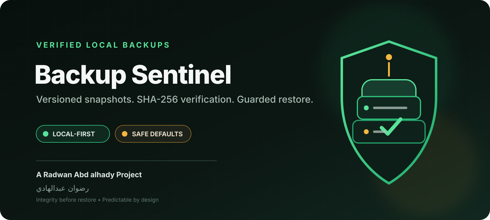
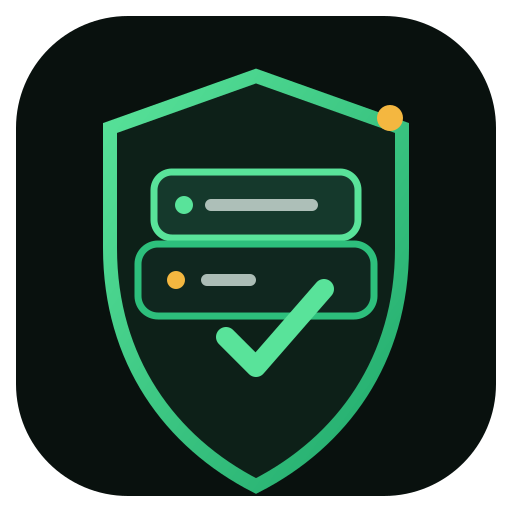

<div align="center">



<br/>



# Backup Sentinel

**Verification-first local backups with versioned snapshots and guarded restore.**

<div dir="rtl">
<strong>نسخ احتياطية محلية بلقطات مستقلة، تحقق SHA-256، واستعادة محمية من الكتابة غير المقصودة.</strong>
</div>

<br/>

[](https://github.com/rad03i2/backup-sentinel/actions/workflows/ci.yml)


**[English guide](README_EN.md) · [الدليل العربي](README_AR.md) · [Architecture](docs/ARCHITECTURE.md) · [Brand](docs/BRAND.md) · [Security](SECURITY.md)**

</div>

---

## The promise

Backup Sentinel is a compact Python CLI for creating self-contained directory snapshots that can be checked before they are trusted again.

<table>
<tr>
<td width="33%"><strong>Snapshot, don't mutate</strong><br/><sub>Each backup is written into a new timestamped snapshot. Creating a new snapshot does not rewrite previous snapshots.</sub></td>
<td width="33%"><strong>Verify what was copied</strong><br/><sub>Files are hashed with SHA-256 during scanning and checked again after copying into the snapshot.</sub></td>
<td width="33%"><strong>Restore behind guardrails</strong><br/><sub>A snapshot must pass verification before restore, and existing destination files are protected unless overwrite is explicit.</sub></td>
</tr>
</table>

Backup Sentinel stays deliberately local: no accounts, telemetry, remote API, cloud transport, or secret configuration is required.

## Backup lifecycle

```text
source directory
      │
      ▼
scan + SHA-256
      │
      ▼
timestamped snapshot
      │
      ├── manifest.json
      └── data/...
      │
      ▼
post-copy verification
      │
      ▼
verify any time
      │
      ▼
guarded restore
```

## Quick start

**Requirement:** Python 3.10 or newer.

```bash
git clone https://github.com/rad03i2/backup-sentinel.git
cd backup-sentinel
python -m pip install .
```

Create a snapshot:

```bash
backup-sentinel create ./important ./my-backups
```

List available snapshots:

```bash
backup-sentinel list ./my-backups
```

Verify one before relying on it:

```bash
backup-sentinel verify ./my-backups <snapshot-id>
```

Restore to a new or empty destination:

```bash
backup-sentinel restore ./my-backups <snapshot-id> ./restored
```

Existing destination files are not replaced unless `--overwrite` is supplied intentionally.

## Command surface

| Command | Purpose | Important behavior |
|---|---|---|
| `create SOURCE REPOSITORY` | Create a new snapshot | Hidden files excluded by default; use `--include-hidden` to include them |
| `list REPOSITORY` | List stored manifests | Returns JSON ordered by snapshot path |
| `verify REPOSITORY SNAPSHOT_ID` | Check snapshot integrity | Reports missing and changed files; exits non-zero when verification fails |
| `restore REPOSITORY SNAPSHOT_ID DESTINATION` | Restore verified data | Refuses corrupted snapshots and overwrite conflicts by default |

## What is protected

- Source and backup repository paths cannot overlap.
- Symbolic links are not followed.
- Every copied backup file is checked against its source SHA-256.
- Snapshot manifests are written atomically.
- Restore verifies the full snapshot before copying.
- Each restored file is copied to a temporary file, hashed, then promoted with `os.replace`.
- Existing restore targets require explicit `--overwrite`.

## Security boundary

SHA-256 here is an **integrity check**, not encryption or authenticated storage. If an attacker can modify both backup data and its manifest, they can replace both consistently.

Backup Sentinel does not encrypt backup contents. Protect the backup destination using filesystem permissions and, where appropriate, disk or volume encryption.

Read the full model in [SECURITY.md](SECURITY.md).

## Snapshot format

```text
my-backups/
└── snapshots/
    └── <snapshot-id>/
        ├── manifest.json
        └── data/
            └── ... original relative paths ...
```

Each manifest stores the snapshot identifier, creation time, source path, file count, total bytes, and a relative path / size / SHA-256 record for every file.

## Tests and CI

Development setup:

```bash
python -m pip install -e ".[dev]"
ruff check .
pytest
```

The current CI workflow runs Ruff and Pytest across:

| Operating system | Python versions |
|---|---|
| Ubuntu | 3.10 · 3.12 · 3.13 |
| Windows | 3.10 · 3.12 · 3.13 |
| macOS | 3.10 · 3.12 · 3.13 |

The test suite covers the core backup path, hidden-file handling, tamper detection, refusal to restore corrupted data, overwrite protection, overlap rejection, and manifest validity.

## Current boundaries

Backup Sentinel currently creates full local copies. It does **not** currently provide:

- incremental or deduplicated storage;
- compression;
- built-in encryption;
- remote or cloud transport;
- a scheduler;
- automatic retention pruning;
- a graphical interface.

Future ideas are kept separate in [ROADMAP.md](ROADMAP.md) so planned work is not presented as existing behavior.

## Repository map

```text
backup-sentinel/
├── assets/
│   ├── project-cover.svg
│   └── project-logo.svg
├── docs/
│   ├── ARCHITECTURE.md
│   └── BRAND.md
├── src/backup_sentinel/
│   ├── __init__.py
│   ├── cli.py
│   └── core.py
├── tests/
│   └── test_backup.py
├── .github/
│   ├── ISSUE_TEMPLATE/
│   ├── PULL_REQUEST_TEMPLATE.md
│   └── workflows/ci.yml
├── README_EN.md
├── README_AR.md
├── ROADMAP.md
├── CHANGELOG.md
├── SECURITY.md
├── CONTRIBUTING.md
└── LICENSE
```

## Documentation

| Document | Use it for |
|---|---|
| [README_EN.md](README_EN.md) | Complete English usage guide |
| [README_AR.md](README_AR.md) | الدليل العربي الكامل |
| [docs/ARCHITECTURE.md](docs/ARCHITECTURE.md) | Components, snapshot format, and safety invariants |
| [docs/BRAND.md](docs/BRAND.md) | Visual identity and asset rules |
| [SECURITY.md](SECURITY.md) | Security model and reporting |
| [CONTRIBUTING.md](CONTRIBUTING.md) | Contribution workflow |
| [ROADMAP.md](ROADMAP.md) | Clearly labeled future ideas |
| [CHANGELOG.md](CHANGELOG.md) | Notable project changes |

---

<div align="center">

### Built by رضوان عبدالهادي

**Radwan Abd alhady Ahmed · [@rad03i2](https://github.com/rad03i2)**

<sub>Backup integrity first. Restore only after verification.</sub>

</div>
